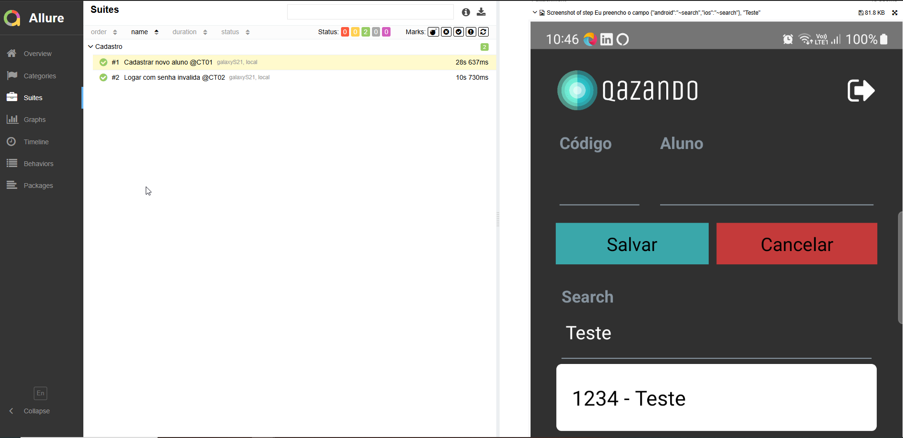
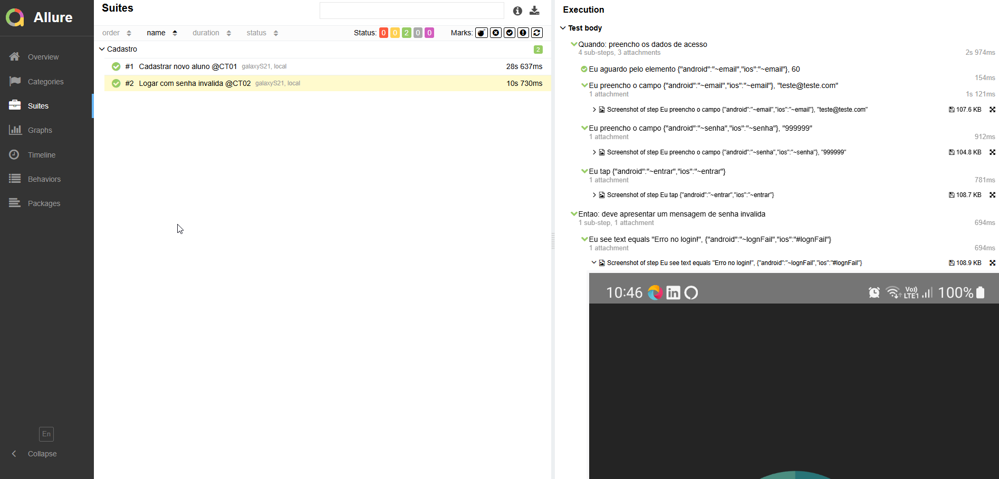

# PROJETO MODELO PARA TESTE MOBILE 
Projeto desenvolvido com proposito de ser um modelo base para teste para mobile (Android e IOS)

## PRÉ-REQUISITOS
Requisitos de software necessários para configuração do ambiente de desenvolvimento

* Visual Studio Code (Last version) [download](https://code.visualstudio.com/download)
* NodeJs [download](https://nodejs.org/pt-br/download/)
* Appium (Configuração de desenvolvimento padrão para Android e IOS)
  * Emulador Android
* Appium Server
* Appium Inspector
* Java 11 - JDK
* Docker (opcional)
* Docker Compose (opcional)

## ESTRUTURA DO PROJETO
| Diretório                | finalidade                                                                                   | 
|--------------------------|----------------------------------------------------------------------------------------------|
| helpers\utils            | classe com objetos staticos para suporte a automação de testes                               |
| helpers\hooks            | Metodos que executam antes e depois de cada teste (@Before, @After)                          |
| resources\app            | Armazenamento dos aplicativos android e ios que será usado pelo script                       |
| resources\conf           | Configuraçao dos capabilities necessários para setup do Appium                               |
| resources\data           | Massa de dados segregada por ambiente, escritos em arquivos yaml                             |
| tests\features           | Funcionalidade e cenários de teste escritos em linguagem DSL (Gherkin language)              |   
| tests\steps              | Local onde deve ser criado as classes que representam os steps definition do cucumber        |
| tests\pages              | Local onde deve ser criado as pages objects para facilitar a manutenção do projeto           |
| codecept.conf.js         | Responsável por fabricar os drivers para os tipos de sistema operacional                     |
| .env                     | Responsável pelas variaves do ambiente                                                       |


## CONFIGURAÇÃO DO PLUGIN DO CUCUMBER

Plugin: *Cucumber (Gherkin) Full Support*

Configuração para habilitar o hiperlink entre step dos arquivos de feature para step definition

```
Acesse: Arquivo > Preferências > Configuração > Extensões > Cumcumber Auto Complete settings > Steps > Editar em Settings.json
```

inclua a configuração, *atenção* ao alterar o arquivo json para não alterar outras informações dentro, altere ou inclua somente o necessário conforme abaixo;

```json
"cucumberautocomplete.steps": [
        

        "./tests/**/*Steps.js"
    ],
    "cucumberautocomplete.syncfeatures": "tests/features/**/*.feature",
    "files.associations": {
        "*.feature": "feature"
    }
```

## INTEGRAÇÃO COM JIRA ZEPHYR

A API deve receber o token de acesso para que possa interagir com Jira, portanto você deverá gerar o token via interface Jira Web

```
 Acesse seu perfil > Tokens de acesso pessoal > Criar token
```

Para não deixar o token exposto, você deve exportar para o SO, a credencial será salva nas variaveis de ambiente
```shell
export TOKEN_BEARER=<your_personal_token>
```
Exemplo: export TOKEN_BEARER=abcdefghi


## FRAMEWORKS UTILIZADOS
Abaixo está a lista de frameworks utilizados nesse projeto
* Appium - Responsável pela interação com os aplicativos mobile
* Allure - report em HTML
* Faker - Geracão de dados sintéticos
* Cucumber - Responsável pela especificação executável de cenários

## COMANDO PARA EXECUTAR OS TESTES
Com o prompt de comando acesse a pasta do projeto, onde esta localizado o arquivo codeceptjs.conf.js, execute o comando abaixo para rodar os testes automatizados.
* single run:
        npx codeceptjs run --verbose

    * *run with report.xml:*
        npx codeceptjs run --reporter mocha-multi

    * *run with cucumber tags:*
        npx codeceptjs run --grep '@tag'

    * *Run with environment variables:*
        ENV APP='app.apk' MODE='emulator' RETRY=1 ENV='hml1' npx codeceptjs run --verbose --reporter mocha-multi --grep @tag

    * run with shortcut, you can parameterize the shortcuts in the script of the `package.json` file (run only git bash): ex: 
        npm run android
        npm run ios
        npm run tag '@test1'


## COMANDO PARA GERAR EVIDÊNCIAS EM HTML (ALLURE)
Com o prompt de comando acesse a pasta do projeto, onde esta localizado o arquivo codeceptjs.conf.js, execute o comando abaixo para gerar as evidências em HTML
Gera o report (Required: JAVA_HOME)

```shell
allure serve output
```

Exemplo




## LOG DE EXECUÇÃO
Os logs de execução gerados pela execução ficam alocados na pasta ./output

  ## LINKS DE APOIO
* [CodeceptJs Appium](https://codecept.io/helpers/Appium.html)
* [CodeceptJs BDD](https://codecept.io/bdd/#gherkin)
* [CodeceptJs Mobile](https://codecept.io/mobile/)
* [Appium API Documentation](https://appium.io/docs/en/about-appium/api/)